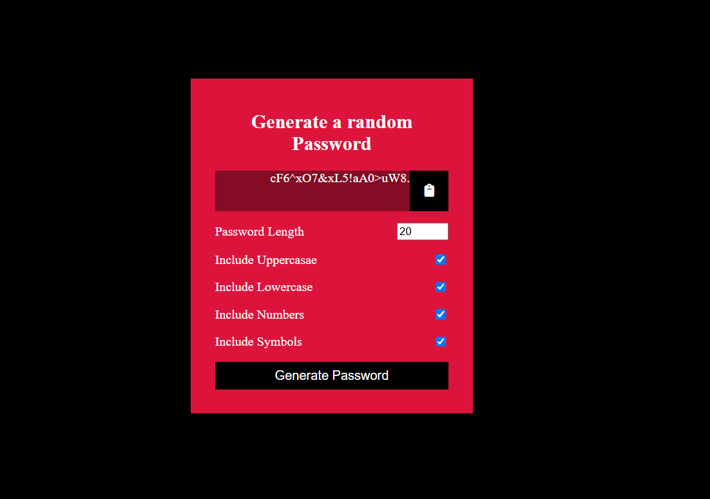

🔐 Random Password Generator
A responsive web application that generates secure, customizable passwords based on user-defined settings. Built using HTML, CSS, and JavaScript, this project allows users to control password length and include/exclude character types like uppercase, lowercase, numbers, and symbols.

🚀 Features
Choose password length (6 to 20 characters)

Toggle character types: uppercase, lowercase, numbers, and symbols

One-click copy to clipboard

Mobile-friendly and clean user interface using CSS Flexbox

Instant password generation without page reload

🛠️ Technologies Used
HTML5

CSS3 (Flexbox for layout)

Vanilla JavaScript

Font Awesome for icons

 
